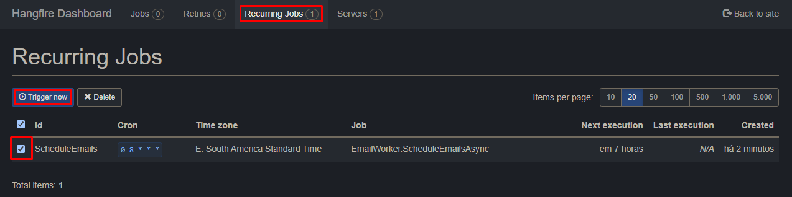
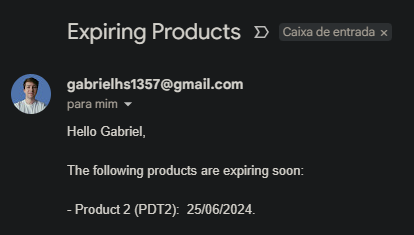
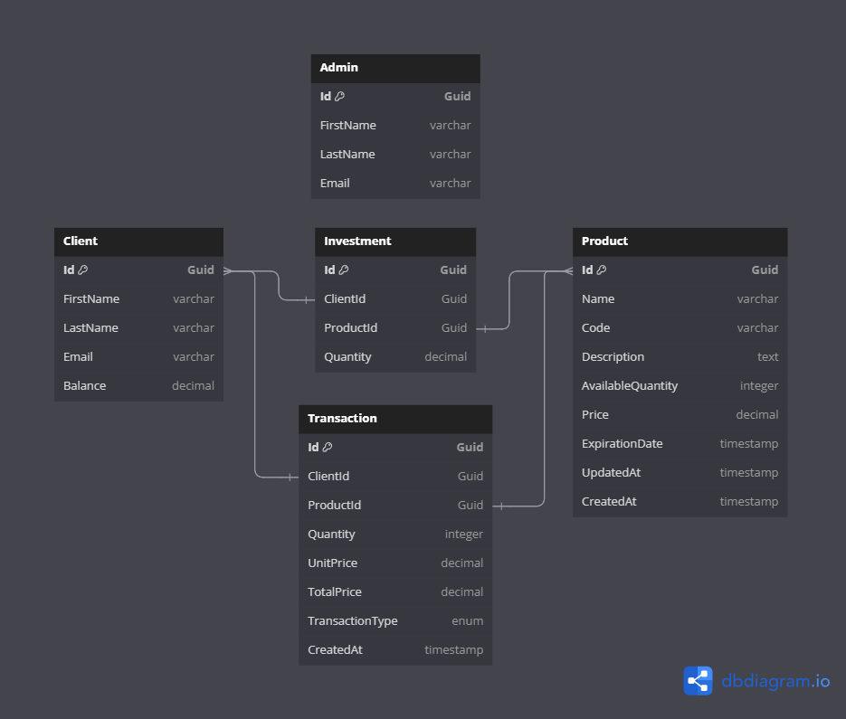

# InvestmentPortfolioManager

> Compre, venda e acompanhe seus investimentos facilmente através do InvestmentPortfolioManager 📈

> Como administrador, gerencie os produtos disponíveis e receba reports diários sobre produtos prestes a expirar 🎯

---

## 📌 Conteúdo

* [Visão geral](#-visão-geral)
* [Disclaimers](#%EF%B8%8F-disclaimers)
* [Funcionalidades](#-funcionalidades)
* [Tecnologias e ferramentas](#-tecnologias-e-ferramentas)
* [Estrutura do projeto](#-estrutura-do-projeto)
* [Requisitos](#%EF%B8%8F-requisitos)
* [Como executar](#-como-executar)
* [API](#-api)
* [Hangfire](#-hangfire)
* [Banco de dados](#-banco-de-dados)
* [Próximos passos](#-próximos-passos)

## 📰 Visão geral

Este projeto faz parte de um desafio técnico realizado para uma empresa do ramo financeiro. A aplicação permite que clientes comprem, vendam e acompanhem seus investimentos em produtos, estes que também são gerenciados por administradores através da aplicação. O projeto foi todo pensando e implementado seguindo uma arquitetura em camadas a fim de promover separação de responsabilidades, facilitar a leitura, facilitar manutenções e melhorar a escalabilidade.

## 🗣️ Disclaimers

- Este README está sendo escrito pouco tempo depois do prazo final para entrega do projeto. Infelizmente não tive tempo suficiente para focar na documentação durante o desenvolvimento, uma vez que concentrei todas os meus esforços entregar um MVP final de qualidade.
- Também precisei adicionar um commit posterior ao prazo final contendo um pequeno fix: os diretórios que armazenam os bancos de dados (`InvestmentPortfolioManager.Infrastructure\Database` e `InvestmentPortfolioManager.Hangfire\Database`) não existiam, já que estavazam vazios uma vez que os arquivos do SQLite (.db) estavam no .gitignore. Para evitar esse problema, adicionei dois arquivos .gitkeep, um em cada diretório.
- Os endpoints não contam com autenticação e nem autorização com a finalidade de facilitar os testes.

## 🚀 Funcionalidades

### Administradores
- Os administradores fazem a gestão dos produtos financeiros
- Os administradores recebem um email diário sempre que algum produto cadastrado tiver sua data de expiração em um range de 30 dias

### Clientes
- Os clientes fazem a gestão de seus investimentos através de compras e vendas
- Os clientes acompanham seus investimentos, sendo também capazes de gerar um extrato de todas as transações realizadas

## 💻 Tecnologias e ferramentas

- [.NET 8](https://dotnet.microsoft.com/en-us/download/dotnet/8.0): é a mais recente versão da plataforma .NET, que proporciona um ambiente de desenvolvimento unificado para a criação de aplicativos de console, web, desktop e mobile. Oferece melhorias de performance, novos recursos e maior suporte a diversas arquiteturas.

- [ASP.NET Core](https://dotnet.microsoft.com/en-us/apps/aspnet): é um framework de desenvolvimento web de código aberto e multiplataforma da Microsoft. Ele permite a criação de aplicativos web modernos, eficientes e escaláveis, oferecendo suporte para APIs RESTful, aplicações MVC e muito mais.

- [Entity Framework Core](https://learn.microsoft.com/en-us/ef/core/) é um ORM (Object-Relational Mapper) de código aberto para .NET. Ele permite que os desenvolvedores trabalhem com um banco de dados usando objetos .NET, eliminando a necessidade de código SQL.

- [SQLite](https://www.sqlite.org/about.html): é um banco de dados SQL leve e embutido, que não requer um servidor separado para operar. É uma escolha bastante utilizada para aplicações de desenvolvimento, testes e pequenos aplicativos distribuídos.

- [AutoMapper](https://automapper.org/): é uma biblioteca de mapeamento de objetos que elimina a necessidade de escrever código de mapeamento manual. Ela permite mapear facilmente objetos de um tipo para outro, simplificando a transferência de dados entre camadas da aplicação.

- [Hangfire](https://www.hangfire.io/): é uma biblioteca de código aberto que permite executar tarefas em segundo plano e agendar tarefas de forma fácil e eficiente em aplicativos .NET. Ele oferece um dashboard para monitoramento e gerenciamento de tarefas.

- [MailKit](https://github.com/jstedfast/MailKit): é uma biblioteca de envio de emails de código aberto para .NET. Ela suporta uma ampla gama de protocolos de email, incluindo SMTP, POP3 e IMAP, e é conhecida por sua performance e facilidade de uso.

- [Swagger](https://swagger.io/): é um conjunto de ferramentas open-source que ajudam a projetar, construir, documentar e consumir APIs RESTful. Ele fornece uma interface interativa para testar e documentar as APIs de forma eficiente.

## 🔍 Estrutura do projeto

A solução está dividida em cinco principais camadas/projetos, cada uma com sua responsabilidade bem definida.

### InvestmentPortfolioManager.API

Esta camada é responsável por expor os endpoints da aplicação, servindo como ponto de entrada para o sistema. Ela lida com as requisições HTTP, faz a validação inicial dos dados e encaminha as solicitações para as camadas apropriadas para processamento.

Componentes:

- **Controllers:** Contém os controladores que definem os endpoints da API.
- **Extensions:** Contém um método de extensão do WebApplication, responsável por rodar migrações sempre que a aplicação for executada.

### InvestmentPortfolioManager.Application

Contém a lógica da aplicação, coordenando as operações entre as camadas de domínio e infraestrutura. Ela define as interfaces para os serviços de aplicação e faz a orquestração das operações necessárias para atender às requisições da API.

Componentes:

- **DTOs:** Objetos de Transferência de Dados usados para comunicar dados entre a API e os serviços de aplicação.
- **Interfaces:** Define "contratos" para os serviços de aplicação.
- **Mappings:** Configurações de mapeamento do AutoMapper.
- **Services:** Implementações dos serviços de aplicação.

### InvestmentPortfolioManager.Domain

Representa a parte de negócio do sistema, contendo as entidades de domínio e interfaces de repositórios que serão implementados posteriormente. Essa camada é independente das outras camadas, focando nas operações que definem o comportamento do negócio.

Componentes:

- **Entities:** Definições das entidades de domínio.
- **Enums:** Enumerações usadas nas entidades de domínio.
- **Repositories:** Interfaces para os repositórios de domínio.

### InvestmentPortfolioManager.Hangfire

Gerencia o agendamento de envio de emails, realizando um processamento em background usando a biblioteca Hangfire. Permite que tarefas de envio de email sejam executadas de forma assíncrona e programada, melhorando a performance e escalabilidade do sistema, além de permitir que as tarefas sejam reenfileiradas em caso de erro.

Componentes:

- **Builders:** Contém o EmailMessageBuilder, responsável pela lógica de criar a mensagem de email.
- **Database:** Armazena o banco de dados (SQLite) utilizado pelo Hangfire.
- **Interfaces:** Define contratos que serão utilizados pela camada.
- **Services:** Implementações do serviço de envio de email.
- **Settings:** Configurações específicas de disparo de email.
- **Tasks:** Definição das tarefas a serem agendadas.
- **Workers:** Definição do EmailWorker, responsável pelo agendamento de envio de emails.

### InvestmentPortfolioManager.Infrastructure

Contém a implementação de acesso a dados e outras infraestruturas necessárias para suportar as operações do sistema, fazendo a comunicação com o banco de dados.

Componentes:

- **Context:** Implementação do contexto do Entity Framework para acesso ao banco de dados.
- **Database:** Configurações do banco de dados.
- **Extensions:** Métodos de extensão para configuração de serviços de infraestrutura.
- **Migrations:** Arquivos de migração do Entity Framework.
- **Repositories:** Implementações dos repositórios definidos na camada de domínio.

## ✔️ Requisitos

- [.NET 8 SDK](https://dotnet.microsoft.com/pt-br/download/dotnet/8.0)
- [Visual Studio 2022](https://visualstudio.microsoft.com/pt-br/vs/) (com o pacote de desenvolvimento do .NET), caso prefira executar a aplicação pelo Visual Studio
- Configurações de SMTP do Google (mais detalhes em [Como executar](#-como-executar))

## 🪛 Como executar

1. Clone o repositório
   ```
   git clone https://github.com/gabrielhs1357/xp-investment-portfolio-manager.git
   cd xp-investment-portfolio-manager
   ```
2. Restaurar Dependências
   ```
   dotnet restore
   ```
3. Executar a API
   ```
   dotnet run --project InvestmentPortfolioManager.API
   ```
3. Realize as configurações de SMTP

   Substitua as configurações de SMTP em `InvestmentPortfolioManager.Hangfire\appsettings.json`. [Aqui](https://www.hostinger.com.br/tutoriais/aprenda-a-utilizar-o-smtp-google) está um guia mais detalhado sobre seu fncionamento. Você também deve precisar criar uma senha de app em https://myaccount.google.com/apppasswords para utiliza-la no lugar da senha da sua conta Google.
   
5. Executar o Hangfire

   Em um novo terminal no diretório da aplicação, execute o projeto contendo o Hangfire
   ```
   dotnet run --project InvestmentPortfolioManager.Hangfire
   ```
6. Acessar aplicação

   - A API estará rodando na porta 5160. Você pode acessar a API e testar os endpoints usando o Swagger em http://localhost:5160/swagger.
   - Você pode visualizar jobs criados pelo Hangfire e trigga-los a qualquer momento pela dashboard, em http://localhost:5058/hangfire.

Você também pode rodar a aplicação diretamente pelo Visual Studio, basta selecionar os projetos de inicialização como `InvestmentPortfolioManager.API` e `InvestmentPortfolioManager.Hangfire` e iniciar a execução (F5 ou botão de Start).

## 💻 API 

- Você pode utilizar o Swagger ou o Postman para testar os endpoints da aplicação.
- Caso utilize o Postman, eu disponibilizei minha [coleção](.github/postman) contendo requisições para todos os endpoints da aplicação.
  - Cada requisição já está configurada para consumir dados inseridos no seed do projeto.
- Existem várias melhorias que eu gostaria de ter implementado, mas acabou não dando tempo. Falarei mais sobre elas em [Próximos passos](#-próximos-passos).

### `api/admins`

| Método | Path | Descrição |
| --- | --- | --- |
| GET | / | Retorna todos os admins |
| GET | /{id} | Retorna os detalhes de um admin |
| POST | / | Cria uma conta de admin |

### `api/products`

| Método | Path | Descrição |
| --- | --- | --- |
| GET | / | Retorna todos os produtos |
| GET | /{id} | Retorna os detalhes de um produto |
| POST | / | Cria um produto |
| PUT | /{id} | Atualiza um produto |
| DELETE | /{id} | Deleta um produto |

### `api/clients`

| Método | Path | Descrição |
| --- | --- | --- |
| GET | / | Retorna todos os clients |
| GET | /{id} | Retorna os detalhes de um cliente |
| POST | / | Cria uma conta de cliente |

### `api/clients/{clientId}/investments`

| Método | Path | Descrição |
| --- | --- | --- |
| GET | / | Retorna todos os investimentos utilizando de um cliente |

### `api/clients/{clientId}/transactions`

| Método | Path | Descrição | Resultado |
| --- | --- | --- | --- |
| GET | / | Retorna todas as transações (extrato) utilizando um clientId | - |
| POST | /buy | Cria uma transação de compra | Atualiza o estoque de produtos, atualiza o saldo do cliente e cria ou atualiza seu investimento naquele produto |
| POST | /sell | Cria uma transação de venda | Atualiza o estoque de produtos, atualiza o saldo do cliente e atualiza seu investimento naquele produto |

## 📧 Hangfire

- Ao executar o Hangfire um job recorrente diário às 8am é criado.
  - Você pode alterar este horário em `InvestmentPortfolioManager.Hangfire/appsettings.json#HangfireSettings`.
- Sempre que um envio de email falha, o Hangfire automaticamente reenfilera essa tarefa para que ela seja executada novamente após certo tempo.
  - O número de retentativas padrão é de 10 vezes.
- Ao acessar a dashboard (http://localhost:5058/hangfire) você consegue triggar manualmente o job recorrente de envio de emails:

<p align="center">
   
</p>

- Email recebido:

<p align="center">
   
</p>

## 🎲 Banco de dados

As entidades da aplicação foram inicialmente planejadas para serem simples, de forma que eu conseguiria ter mais tempo para entregar um MVP completo e funcional. A ideia seria evoluir as entidades para algo mais complexo posteriormente caso sobrasse algum tempo.

<p align="center">
   
</p>

## ✅ Próximos passos

Deixo aqui alguns próximos passos que planejei, bem como algumas considerações.

- [ ] Cache
  - Um dos requisitos era conseguir manter um baixo tempo de resposta e suportar um alto número de requisições na listagem de produtos e extratos
  - Eu gostaria de ter adicionado uma camada de cache nesses fluxos através do MemoryCache, mas acabou não dando tempo
- [ ] Consistência transacional no fluxo de TransactionService
  - Esse é um fluxo onde na compra e venda de produtos acontecem uma série de atualizações em sequência no banco de dados
  - Por esse motivo, seria essencial garantir consistência em suas alterações
  - Algumas opções seriam utilizar o padrão Unit of Work ou o DbContextTransaction (do Entity Framework)
- [ ] Melhorar tratamento de erros e validações
- [ ] Testes (unitários, integração e E2E)
  - Deixei os testes para o final, mas acabei não tendo tempo de implementá-los
  - Testes são muito importantes, em projetos reais sempre tomo muito cuidado para imeplementa-los cobrindo o máximo de cenários possíveis
- [ ] Mapeamentos de entidades no Entity Framework
  - Gostaria de ter melhorado o mapeamento de algumas entidades através do OnModelCreating
  - Algumas melhorias nesse sentido seriam: salvar o TransactionType como string ao invés de int (usando o Enum existente), adicionar indíces nas colunas de Email (Admin/Client) e Code (Product), etc.
- [ ] Suporte a Docker
- [ ] Autenticação e autorização
- [ ] Melhorar documentação do Swagger
- [ ] Evolução do produto
  - O produto pensado para essa aplicação é bem simples
  - Acredito que adicionar maiores complexidades seria interessante para o projeto, tais como taxas de juros randomizadas, rentabilidade de investimentos, etc.
- [ ] ...

---

<p align="center" style="margin-top: 20px; border-top: 1px solid #eee; padding-top: 20px;">Made with 💜 by <a href='https://github.com/gabrielhs1357'>Gabriel Silva</a>.</p>
